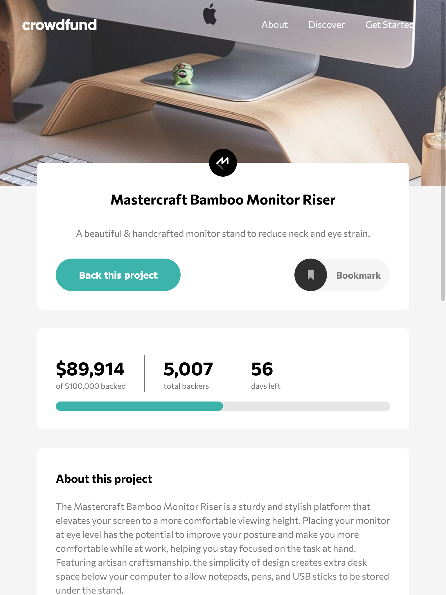
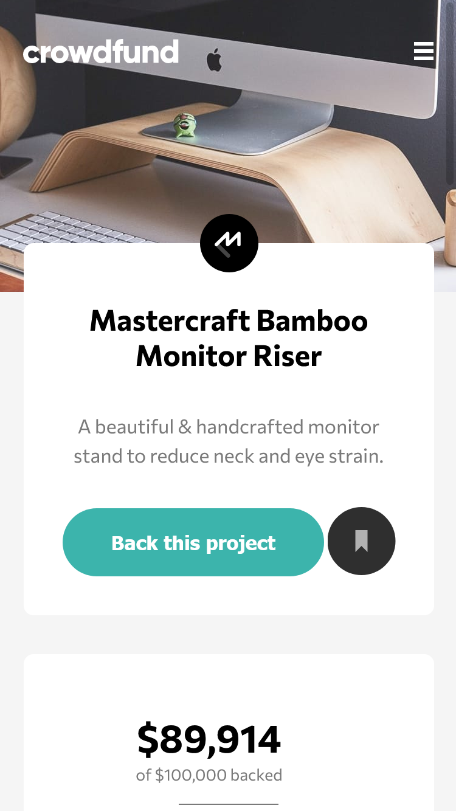

# Frontend Mentor - Crowdfunding product page solution

This is a solution to the [Crowdfunding product page challenge on Frontend Mentor](https://www.frontendmentor.io/challenges/crowdfunding-product-page-7uvcZe7ZR). Frontend Mentor challenges help you improve your coding skills by building realistic projects.

## Table of contents

- [Overview](#overview)
  - [The challenge](#the-challenge)
  - [Screenshot](#screenshot)
  - [Links](#links)
- [My process](#my-process)
  - [Built with](#built-with)
  - [What I learned](#what-i-learned)
  - [Useful resources](#useful-resources)
- [Author](#author)

## Overview

### The challenge

Users should be able to:

- View the optimal layout depending on their device's screen size
- See hover states for interactive elements
- Make a selection of which pledge to make
- See an updated progress bar and total money raised based on their pledge total after confirming a pledge
- See the number of total backers increment by one after confirming a pledge
- Toggle whether or not the product is bookmarked

### Screenshot




### Links

- Solution URL: [Visit](https://github.com/mcclintsayshi/crowdfunding-product-page-main)
- Live Site URL: [Visit](https://mcclintsayshi.github.io/crowdfunding-product-page-main/)

## My process

- I started by going through the designs
- Then wrote the HTML code
- After I was satisfied with the HTML I went on to write CSS
- There were some HTML elements I had to change while busy with the CSS in order to fit the layout
- After doing the basic CSS needed I also started writing Javascript to handle actions

### Built with

- Semantic HTML5 markup
- CSS custom properties
- Flexbox
- CSS Grid
- Mobile-first workflow
- Javascript

### What I learned

```css
/* CSS code I'm proud of */
.container {
  position: relative;
}
.box {
  position: absolute;
  top: 0;
  left: 50%;
  transform: translate(-50%, -50%);
}
```

### Useful resources

- [HTML Progress Bar Tutorial](https://www.youtube.com/watch?v=z_R13WXXovw) - This helped me to implement the progress bar.

## Author

- Website - [Clinton Manakane](https://clint.netlify.app)
- Frontend Mentor - [@mcclintsayshi](https://www.frontendmentor.io/profile/mcclintsayshi)
- Twitter - [@mcclintsayshi](https://www.twitter.com/mcclintsayshi)
